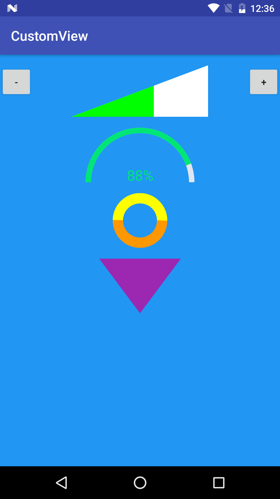

# CustomView
a simple example of a custom view
with support to XML attributes and image src



### Examples

VolumeView

``` xml

    <com.example.customview.VolumeView
        android:layout_width="200dp"
        android:layout_height="75dp"
        android:src="@android:drawable/ic_lock_silent_mode_off"
        app:volume_back_color="@color/purple"
        app:volume_normal_color="@color/orange"
        app:volume_base_percentage="0.4"
        app:volume_high_percentage="0.7"/>

```

``` java

    volumeView.increase();
    volumeView.decrease();

```

ArcView

``` xml

    <com.example.customview.ArcView
        android:layout_width="wrap_content"
        android:layout_height="wrap_content"
        app:arc_low_color="@color/red"
        app:arc_mid_color="@color/orange"
        app:arc_high_color="@color/green"
        app:arc_width="10dp"
        android:textSize="20sp"
        android:textColor="@color/grey" />

```

``` java

	arcView.setDestAngle(160);
    arcView.setHighColor(ContextCompat.getColor(this, R.color.yellow));
    arcView.setBackColorRes(R.color.red);

```

CircleView

``` xml

    <com.example.customview.CircleView
        android:layout_width="80dp"
        android:layout_height="80dp"
        app:circle_bottom_color="@color/red"
        app:circle_top_color="@color/purple"
        app:circle_stroke_width="10dp" />

```

TriangleView

``` xml

    <com.example.customview.TriangleView
        android:layout_width="120dp"
        android:layout_height="80dp"
        app:triangle_color="@color/purple" />


```